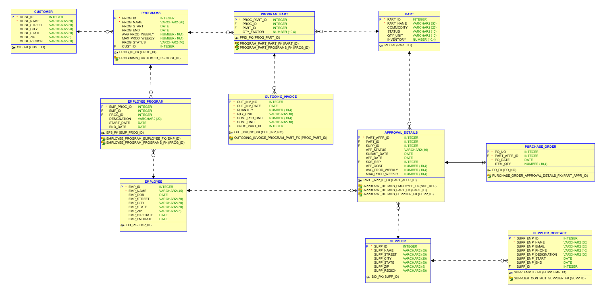

# SupplyChainDB
# Supply Chain Database

## ERD

### ToDo

- [x] Admin User creation
- [x] Create Tables
- [x] Insert test data
- [x] Create views
- [x] Create reports

### Views :
- [x] ACTIVE_SUPPLIER;
- [x] APPROVAL_WITH_EMPLOYEE
- [x] APPROVAL_WITH_SUPPLIER
- [x] CUSTOMER_PROGRAM_EMPLOYEE
- [x] CUSTOMER_PROGRAM_INVOICE
- [x] CUSTOMER_PROGRAM_PART
- [x] EVALUATION_STATS_EMPLOYEE
- [x] EVALUATION_STATS_SUPPLIER
- [x] INVENTORY_FLOW_STATUS
- [x] PART_APPROVAL_SUPPLIER
- [x] PROJECT_BY_CUSTOMER

### Stored Procedures
- [x] Approval Chances By Supplier
- [x] Employee Evaluation
- [x] Approval of Part By Supplier with Employee

### Triggers
- [x] REGION_BEFORE_INSERT
- [x] ZIP_BEFORE_INSERT

### Function
- [x]  Generate Full Address from columns

